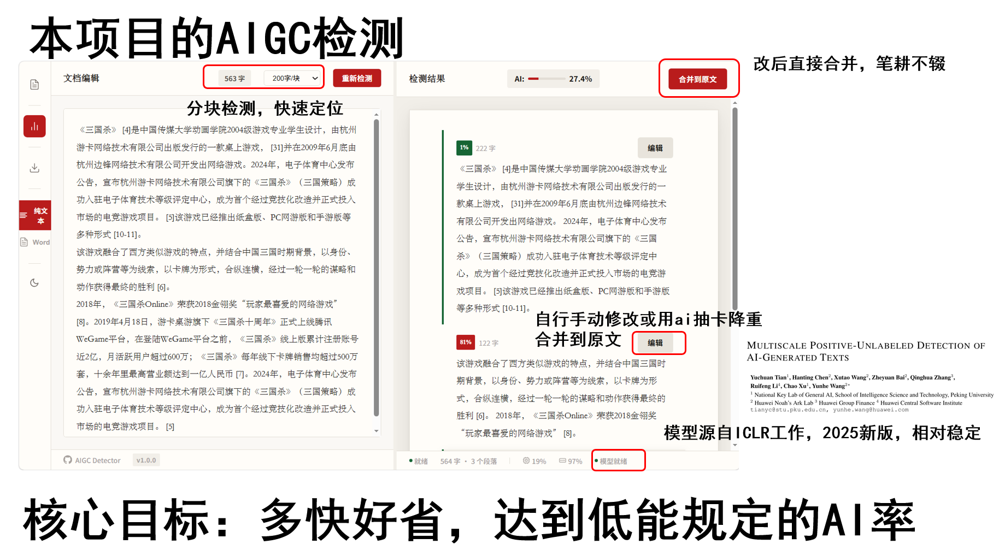
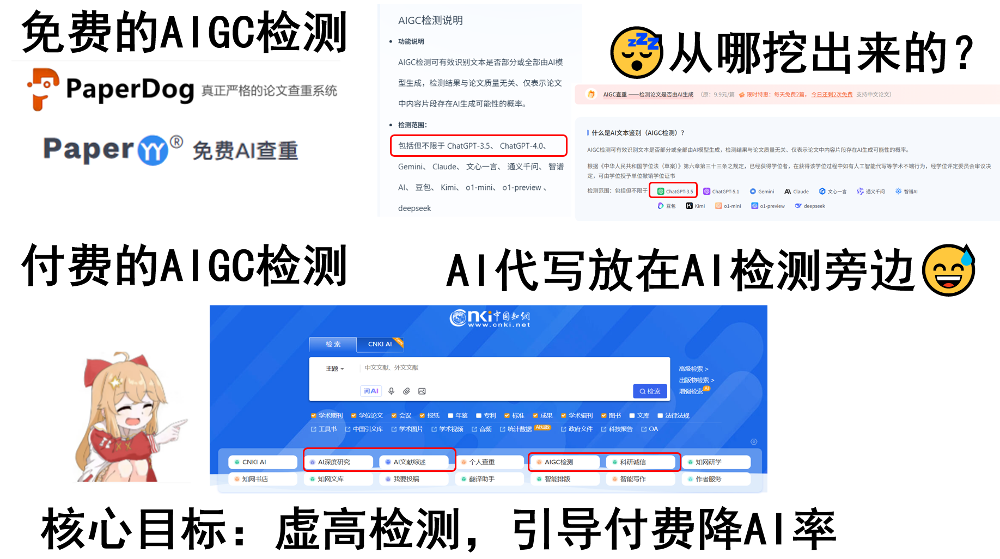

# AIGC 文本检测器 (墨审)

> **免责声明**：本项目仅供技术研究和教育目的使用。AI 文本检测结果仅供参考，不应作为判断文本真实来源的唯一依据。本项目不对检测结果的准确性、完整性或可靠性作任何承诺，使用者需自行承担使用风险。请勿将本工具用于学术不端检测、虚假信息溯源等敏感场景。





一个基于深度学习的中文 AI 生成文本检测 Web 应用，支持文本粘贴/文件导入、分块检测、阅读器风格界面。


## 功能特性

- 📝 **文本输入** - 支持直接粘贴或导入 TXT/Word 文档
- 🔍 **AIGC 检测** - 基于 RoBERTa 中文预训练模型的文本分类
- 📖 **阅读器风格** - 连续文本展示，段落级别 AI 概率标注
- ✏️ **编辑修改** - 点击段落可编辑，实时重新检测
- 📊 **分块检测** - 可调节分块大小 (原文/200/500/1000 字)
- 🌐 **双模式编辑** - 纯文本模式和 Word 模式
- 🌙 **深色模式** - 支持浅色/深色主题切换
- 🔄 **合并到原文** - 将编辑后的文本合并回原文

## 快速开始

### 方式一：使用启动脚本（Windows 推荐）

```bash
start.bat
```

### 方式二：手动启动

#### 1. 克隆项目

```bash
git clone <repository-url>
cd AIGC_detector_zhv3
```

#### 2. 创建虚拟环境并安装依赖

```bash
# Windows
python -m venv venv_web
venv_web\Scripts\activate
pip install -r requirements_web.txt

# Linux/Mac
python -m venv venv_web
source venv_web/bin/activate
pip install -r requirements_web.txt
```

#### 3. 安装前端依赖

```bash
cd frontend
npm install
cd ..
```

#### 4. 启动服务

```bash
# 同时启动后端和前端开发服务器
python run_dev.py

# 或者分开启动：
# 终端1：启动后端
python app.py

# 终端2：启动前端
cd frontend
npm run dev
```

#### 5. 访问 Web 界面

打开浏览器访问: http://localhost:5173

> **注意**：首次启动时模型加载需要 10-30 秒，请耐心等待。

## 项目结构

```
AIGC_detector_zhv3/
├── app.py                      # Flask 后端服务
├── run_dev.py                  # 开发环境启动脚本
├── start.bat                   # Windows 一键启动脚本
├── requirements_web.txt        # Python 依赖
├── frontend/                   # React 前端
│   ├── src/
│   │   ├── App.tsx           # 主应用组件
│   │   └── index.css         # 样式文件
│   ├── node_modules/         # 前端依赖（npm install 后生成）
│   └── dist/                  # 构建输出目录
├── pytorch_model.bin          # 模型权重（约 400MB）
├── config.json                # 模型配置
├── tokenizer_config.json      # 分词器配置
├── vocab.txt                  # 词汇表
└── special_tokens_map.json    # 特殊 token
```

## 使用说明

### 基本检测流程

1. 在左侧编辑器粘贴或输入文本
2. 选择分块大小（默认"原文"）
3. 点击"开始检测"按钮
4. 在右侧查看检测结果

### 编辑和重新检测

1. 点击任意段落，该段落会被选中
2. 点击段落内的"编辑"按钮
3. 修改文本后点击"重新检测"
4. 观察该段落 AI 概率变化

### 合并到原文

编辑多个段落后，点击"合并到原文"按钮，将所有编辑合并回左侧编辑器。

### 分块大小选择

- **原文**：保持原有段落结构
- **200字/块**：较细粒度，适合短文本
- **500字/块**：中等粒度
- **1000字/块**：较粗粒度，适合长文本

## 技术栈

- **后端**: Flask, PyTorch, Transformers (BERT/RoBERTa)
- **前端**: React 18, TypeScript, Vite
- **模型**: Chinese RoBERTa (chinese-roberta-wwm-ext)

## 系统要求

- Python 3.8+
- Node.js 16+
- PyTorch 1.10+
- 4GB+ RAM（推荐 8GB）
- GPU 加速（可选，但推荐）

## 常见问题

### Q: 启动后显示"模型加载中"？
A: 首次启动需要加载模型权重，请等待 10-30 秒。GPU 可用时会自动使用 GPU 加速。

### Q: 检测结果不准确？
A: 当前模型基于特定数据集训练，对某些类型的 AI 文本可能检测效果不佳。模型对古代文言文等特殊文本的检测尤其不准确。

### Q: 如何切换深色模式？
A: 点击左下角工具栏中的月亮/太阳图标。

### Q: Word 模式跳转功能不可用？
A: Word 模式的编辑器跳转功能正在修复中，建议使用纯文本模式。

## 开发说明

### 前端开发

```bash
cd frontend
npm run dev    # 开发服务器
npm run build # 生产构建
```

### 后端开发

```bash
python app.py  # 启动 Flask 服务（调试模式）
```

## License

Apache License 2.0
